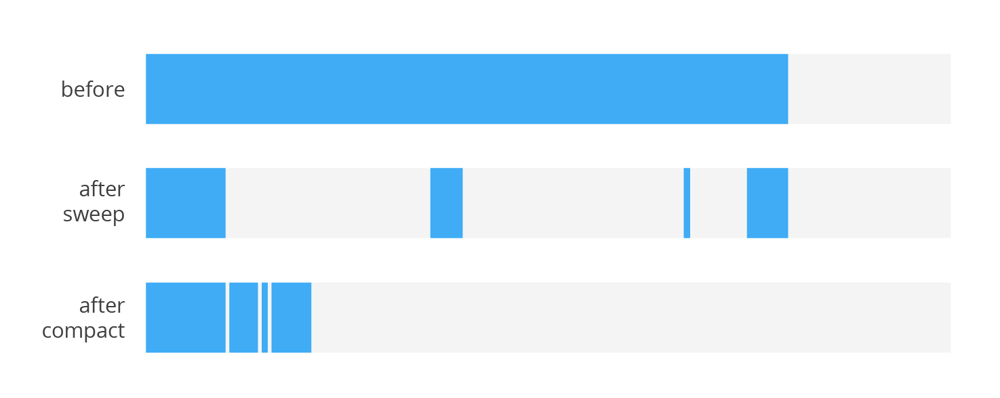

# Garbage Collector

Garbage collection (GC) is a form of automatic memory management. The garbage collector, or just collector, attempts to reclaim garbage, or memory occupied by objects that are no longer in use by the program. 

## Garbage Collection Roots—The Source of All Object Trees

Every object tree **must** have one or more root objects. As long as the application can reach those roots, the whole tree is reachable. But when are those root objects considered reachable? Special objects called garbage-collection roots are always reachable and so is any object that has a garbage-collection root at its own root. There are four kinds of GC roots in Java:

* Local variables: are kept alive by the stack of a thread. This is not a real object virtual reference and thus is not visible. For all intents and purposes, local variables are GC roots.
* Active Java threads: are always considered live objects and are therefore GC roots. This is especially important for thread local variables.
* Static variables are referenced by their classes.
* JNI References: are Java objects that the native code has created as part of a JNI call.

An object becomes a good candidate for garbage collection when there are no references to it. The first step, GC starts a **MARK phase**. GC traverses a whole objects tree. Every created object has a mark bit which is set to 0 by default. When an object is visited in the mark phase, its mark bit is set to 1 — it means it’s reachable. After that, the GC runs the next phase — **sweeping**. In this case, the GC searches the memory heap in order to find all objects with a mark bit set to 0 to remove. Then reset mark bits of all reachable objects back to 0.

**The MARK phase has a hidden cost, because it's "stop the world event".**

## Stop the world event!

Simple GCs are [stop-the-world event](https://en.wikipedia.org/wiki/Tracing_garbage_collection#Stop-the-world_vs._incremental_vs._concurrent) (stw), it completely halt execution of the program to run a collection cycle, thus **guaranteeing that new objects are not allocated and objects do not suddenly become unreachable while the collector is going through the objects tree**.

**The pause duration depends on the number of reachable objects**. The total number of objects or the heap size doesn’t matter. That’s why creating many “alive” unnecessary objects is painful — for instance, autoboxing inside a loop. **The GC starts the process, when the memory heap is almost full**. So, when you create many unnecessary objects, you fill up the memory heap quicker, which in turn generates more GC cycles and more frame drops, because every pause uses up your app’s time

In general GC does not require stw pause. Modern GC implementations try to minimize blocking stw stalls by doing as much work as possible on the background thread. Also there are JVM implementations which are (almost) pause free (e.g. [Azul Zing JVM](https://www.azul.com/products/zing/)). Whenever JVM require stw to collect garbage depends on algorithm it is using. 

## Common GC algorithm

#### Concurrent Mark Sweep (CMS)

Android uses the most common type of garbage collection, known as tracing garbage collection with the CMS algorithm. 

CMS stands for Concurrent Mark-Sweep. This is another algorithm in HotSpot JVM which does NOT utilize stw pause for old space collection (not exactly same thing as full collection). Also see: https://stackoverflow.com/a/21230308/5282585/. It scans only the portion of the heap that was modified since the last GC and can reclaim only the objects allocated since the last GC.

#### Mark Sweep Compact (MSC)

The CMS plan has a drawback, it may lead to memory heap fragmentation. It means that your heap may have quite a lot of space in total (free memory), but this space is divided into small blocks. Then Mark Sweep Compact created to solve this.

Mark Sweep Compact (MSC) is popular algorithm used in HotSpot by default. It is implemented in stw fashion and has 3 phases:
* **MARK** - traverse live object graph to mark reachable objects
* **SWEEP** - scans memory to find unmarked memory
* **COMPACT** - relocating marked objects to defragment free memory

There’s no such thing as a free lunch. **This enhancement increases the GC pause**. When relocating objects in the heap, the JVM should update all references to this object. During this process the object graph is inconsistent, that is why stw pause is required.

GC also have many disadvantages such as consuming additional resources, performance impacts, possible stalls in program execution, and incompatibility with manual resource management. So you should **take care of memory yourself, not just rely on it**
