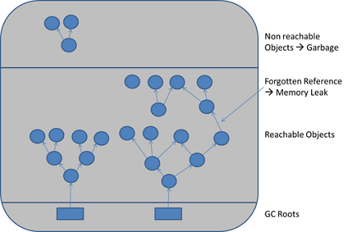
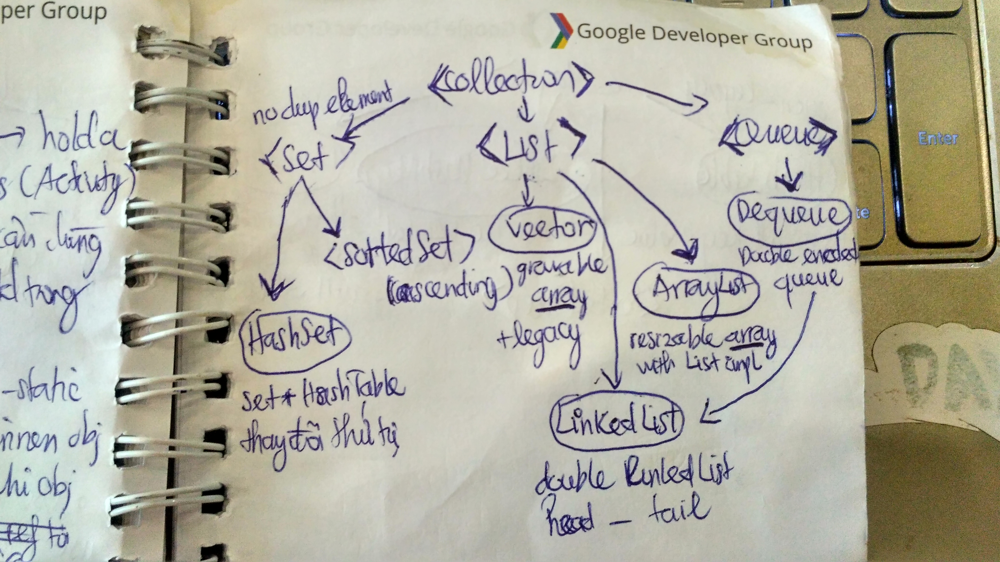
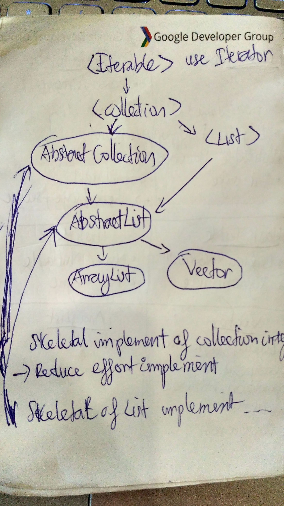
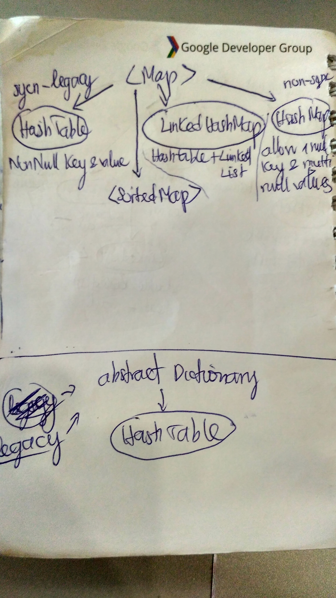

# Android Development Notes

## Bitmap

* Choose decode method.
* Load a sealed down version to memory.
* Use [LRUCache](https://developer.android.com/reference/android/util/LruCache.html) to [cache bitmaps](https://developer.android.com/topic/performance/graphics/cache-bitmap.html#memory-cache), keep reference objects using strong reference in `LinkedHashMap`, clear the least used before the cache is full to make room for new bitmaps.
* Use [DiskLRUCache](https://github.com/JakeWharton/DiskLruCache) to cache bitmap on hard disk (avoid load again when process interupted).

## Process and Thread

* All are execution environment. Process can consist of 1 or many thread(s) but a thread can only belong to 1 process.
* Context switching: Store the state of process or thread for resume later. Allow multi process to share a single CPU.
* `AsyncTask` will be [execute serially](https://stackoverflow.com/a/18661403/5282585) by default on Android API >= 13. Because of that it will block other `AsyncTask`. To resolve this we use [ThreadpoolExecutor](https://developer.android.com/reference/java/util/concurrent/ThreadPoolExecutor.html) to execute parallel.

| Process        | Thread          |
| -------------|---------------|
| Heavy weight | Light weight |
| Process creation is costly | Thread creation is economy |
| Not share memory | Memory shared between threads in same process |
| IPC is slow because too many addresses | Communication between threads is fast because they shared mem address |
| Forced to communicate via messages |  |

## Threading

#### Runnable

A runnable isn't a background thread, it is a unit of work that can be run in a given thread.

#### When to use Handler#post() and when to use Thread#start().

* se `Handler.post()` whenever you want to do operations in the UI thread. So let's say in the callback (which is running in **separate thread**) you want to change a TextView's text, you should use `Handler.post()`.

* If whatever you are doing is "heavy" you should be doing it in a Thread (That's why network operation is forced to do in a worker thread in Android). Interestingly when you are using a separate **worker thread** it is often useful to also use a `Handler` to communication between this working thread and the main UI thread.

* Must note that: `Handler` and `Thread` are really 2 different things and do NOT contradict each other. `Handler` can be used to attach to a thread and provides a simple channel to send data to this thread. And a `Thread` is basically the core element of multithreading which a developer can use to get heavy payload work off main thread.

* The difference between `Hander.post()` and `View.post()` is that Handler will run your code **on the thread the Handler instance was created on** (which is not necessarily the UI thread) because it will be attached to the only looper of this thread to communicate, while View will **always run it on the UI thread** (because views are bound to it).

#### HandlerThread

You would use `HandlerThread` in case that you want to perform long background tasks **sequentially**, one at a time and you want that those tasks will run at the order of execution. The HandlerThread has it's **own looper** and handlers could be created and post it, (so it would not block the main thread). And use the `Handler` inside it to communication between the worker thread and the caller thread.

For more information related to performance, see [this](https://github.com/nhoxbypass/android-development-patterns-note/blob/master/performance_note.md#season-5-ep-02) and [this](https://github.com/nhoxbypass/android-development-patterns-note/blob/master/performance_note.md#season-5-ep-05).

For real life example, look at [this](https://stackoverflow.com/questions/18149964/best-use-of-handlerthread-over-other-similar-classes).

#### Ways to get work off main thread.

1. Create new `Thread`: `Thread t = new Thread(new Runnable() {...});` then start it `t.start()`.
2. Create a new [class](https://stackoverflow.com/questions/9671546/asynctask-android-example) that extends `AsyncTask`, and implement the code that need work off main thread inside `doOnBackground()` callback. Then write code to update result, UI inside `onPostExecute()` callback. Finally init and `execute()` this task.
3. Create a new `HandlerThread` and start the same as normal Thread. And use Handler to communicate. See [this](https://stackoverflow.com/questions/25094330/example-communicating-with-handlerthread).
4. Create a new class that extends `IntentService` and implement it. Then trigger start using an Intent to pawns a new worker thread. See [this](https://code.tutsplus.com/tutorials/android-fundamentals-intentservice-basics--mobile-6183).

See [this](https://github.com/nhoxbypass/android-development-patterns-note/blob/master/performance_note.md#season-5-ep-01) to see when to use which approach.

## Stack vs Heap in memory

All stored in RAM. But thread have it own stack but share heap memory.

| Stack        | Heap          |
| -------------|---------------|
| Auto delete memory when variable go out of scope | Remain until collect by program or GC triggerd |
| Fixed [size](https://stackoverflow.com/questions/16843357/what-is-the-android-ui-thread-stack-size-limit-and-how-to-overcome-it) -> cause [StackOverflow](https://stackoverflow.com/questions/214741/what-is-a-stackoverflowerror) | Can get more memory from OS |
| Faster, only need to move pointer to allocate | Slower, synchronize to keep thread safe, complex flow to allocate |
| Attach to thread, when thread stop -> reclaim | Attach to app process, process exit -> reclaim |
| Store local data, return data, params address, primitive variables | Store block of data, all object instance, static variable (Perm Gen) |
| Fixed [size](https://stackoverflow.com/questions/16843357/what-is-the-android-ui-thread-stack-size-limit-and-how-to-overcome-it) vary by Android API | Max 64Mb default in Java, max Android heap size vary by device's screen size |
| Cause `StackOverflow` | Cause memory fragmentation, memory leaks, `OutOfMemoryError` |

## Android heap

**Android heap contain Java heap, native heap and ashmem**. 

Note that memory usage on modern operating systems like Linux is an extremely [complicated and difficult to understand area](https://stackoverflow.com/questions/2298208/how-do-i-discover-memory-usage-of-my-application-in-android). 

Android limit heap size per process.
Max heap size is vary [by screen resolution](https://stackoverflow.com/a/5352488/5282585). As higher-resolution screens tend to want to manipulate larger bitmaps -> need more heap -> Google makes heap size recommendations and hope device manufacturers will abide by.

`OutOfMemory` error mostly cause from bitmaps, leak memory that GC cannot free. Enable [hardware accelerate](https://developer.android.com/guide/topics/graphics/hardware-accel.html) (allow draw canvas using GPU) will consume more RAM memory.

* `getRuntime().maxMemory()` is total bytes of heap that our app is **allowed to use**.
* `ActivityManager.getMemoryClass()` is total MB of heap that our app **should use** to respect limit of device.
* Read `heapstartsize`, `heapgrowlimit`, `heapsize` information inside `system/build.prop` file.
* Put `android:largeHeap="true"` in `AndroidManifest.xml` let the heap grow from `heapgrowlimit` to `heapsize` (Android API >= 11). But no guarantee.
* Request native heap using NDK JNI.

## Java heap

| Eden  | S0   | S1      |  Old Gen | Perm Gen |
| -------|-------| ------- | ------- | ------- |
|        |       |         | Major GC |        |

## Native heap

The native heap used by the C++ `new` operator. There is much more memory available here. The app is limited only by the physical memory available on the device. There is no garbage collection and nothing to slow things down. However, C++ programs are responsible for freeing every byte of memory they allocate, or they will leak memory and eventually crash. 

The native heap is managed by `dlmalloc()`, which uses a combination of `mmap()` and standard calls like `sbrk()` to allocate memory. The managed ("Dalvik") heap is (mostly) one large chunk allocated with `mmap()`. It's all running on top of the Linux kernel.

## Ashmem (ashmem.c)

* short term for **Android Shared Memory**.
* This operates much like the native heap but has additional system calls.
* Share memory between process using memory maps by name.
* Android can "unpin" the memory rather than freeing it. This is a lazy free; the memory is freed only if the system actually needs more memory. Then "pin" later on when device have enough memory back.
* Better support low-mem devices because it can discard shared mem unit under memory pressure.
* Removed in Android 5.0 and higher.
* Using C.

## Garbage Collector

Garbage collection (GC) is a form of automatic memory management. The garbage collector, or just collector, attempts to reclaim garbage, or memory occupied by objects that are no longer in use by the program. 

#### Garbage-Collection Roots—The Source of All Object Trees

Every object tree **must** have one or more root objects. As long as the application can reach those roots, the whole tree is reachable. But when are those root objects considered reachable? Special objects called garbage-collection roots are always reachable and so is any object that has a garbage-collection root at its own root. There are four kinds of GC roots in Java:

* Local variables: are kept alive by the stack of a thread. This is not a real object virtual reference and thus is not visible. For all intents and purposes, local variables are GC roots.
* Active Java threads: are always considered live objects and are therefore GC roots. This is especially important for thread local variables.
* Static variables are referenced by their classes.
* JNI References: are Java objects that the native code has created as part of a JNI call.

#### Stop the world event!

Simple GCs are [stop-the-world event](https://en.wikipedia.org/wiki/Tracing_garbage_collection#Stop-the-world_vs._incremental_vs._concurrent), it completely halt execution of the program to run a collection cycle, thus guaranteeing that new objects are not allocated and objects do not suddenly become unreachable while the collector is running.

In general GC does not require stop-the-world pause. Modern GC implementations try to minimize blocking "stop-the-world" stalls by doing as much work as possible on the background thread. Also there are JVM implementations which are (almost) pause free (e.g. [Azul Zing JVM](https://www.azul.com/products/zing/)). Whenever JVM require STW to collect garbage depends on algorithm it is using. 

**Mark Sweep Compact (MSC)** is popular algorithm used in HotSpot by default. It is implemented in STW fashion and has 3 phases:
* **MARK** - traverse live object graph to mark reachable objects
* **SWEEP** - scans memory to find unmarked memory
* **COMPACT** - relocating marked objects to defragment free memory
When relocating objects in the heap, the JVM should update all references to this object. During this process the object graph is inconsistent, that is why STW pause is required.

**Concurrent Mark Sweep (CMS)** This is the default plan of ART. This is another algorithm in HotSpot JVM which does NOT utilize STW pause for old space collection (not exactly same thing as full collection). Also see: https://stackoverflow.com/a/21230308/5282585/. It scans only the portion of the heap that was modified since the last GC and can reclaim only the objects allocated since the last GC.

There is also **G1** which is an incremental variation of MSC.

GC also have many disadvantages such as consuming additional resources, performance impacts, possible stalls in program execution, and incompatibility with manual resource management. So you should **take care of memory yourself, not just rely on it**

## Memory leaks

#### Unregister listener

Without calling the unregister method, the instance will probably **keep a reference** around long after the referenced object has been terminated and will thus start leaking memory. But it [depends](https://stackoverflow.com/a/5010949/5282585) on what those listeners are registered upon.
Eg: a simple well-written `OnClickListener` for a button should not result in a memory leak. However, a `LocationListener`, registered with the `LocationManager` - which is a **system service & keep living until device shutdown** - is held by the process. Hence, even if the activity is destroyed, the **listener will remain registered**. If that listener is an **inner class**, it will continue to hold an implicit reference to the activity, and you will have a memory leak.

#### Non-static nested class (inner class)

Inner class hold a **strong implicit reference** to outer enclosing class. So Activity and entire view hierachy that use inner AsyncTask (most famous, well-known case) will [be leaked](https://github.com/nhoxbypass/android-development-patterns-note/blob/master/performance_note.md#season-5-ep-04) if it get **destroyed before** the AsyncTask work completed.
-> Use static nested class, send objects that needed from instance of outer class through constructor and hold inside `<WeakReference>`.

#### Anonymous Class

Also an inner class. It usually cause memory leaks by an object have reference to this anonymous class without any information about it's outer container object, **when the outer container object not use anymore, but the anonymous class still alive** (because of still have a reference from outside) then this anonymous class and entire outer container object leaks and cannot be GC.

#### Bitmap

-> Remember to `setBackgroundResource(null)` and `recycle()` bitmaps after use.

#### Context

Can leak entire Activity + view tree when device roration.
-> Avoid static context, use `getApplicationContext()` for long-live object.

#### Resource not closed

## Loader

* What do we do with the threaded work when the activity that kicked it off is no longer alive? See [this](https://github.com/nhoxbypass/android-development-patterns-note/blob/master/performance_note.md#season-5-ep-08).

* Help **loading data in worker thread** to avoid ANR due to performing potentially slow queries.

* Compare to `AsyncTask` (which also load data in worker thread) it help **simplying management of both the thread and the UI thread** (through various activity or fragment lifecycle events, such as `onDestroy()` and configurations changes) by providing callback methods when events occur.

* Loaders **survive across configuration changes** so it persist and cache results to prevent duplicate queries.

* Implement an observer to **listen for changes in the underlying data source**. Eg: `CursorLoader` automatically registers a `ContentObserver` to trigger a reload when data changes

* Loaders **don’t stay around forever**. They’ll be automatically cleaned up when the requesting Activity or Fragment is permanently destroyed. That means no lingering, unnecessary loads.

**Working with the rest of your app: the `LoaderManager`**. 

Of course, even the best loader would be nothing if it wasn’t connected to something. That connection point for activities and fragments comes in the form of `LoaderManager`. You’ll call `FragmentActivity`’s `getSupportLoaderManager()` or a `Fragment`’s `getLoaderManager()` to get your instance.

In almost every case, there’s only one method you’ll need to call: `initLoader()`. This is generally called in `onCreate()` or `onActivityCreated()` — basically as soon as you know you’ll need to load some data. There’s a `restartLoader()` method which gives you the ability to force a reload but un-necessary in most cases.

**Loaders: for data only**

If you’ve been using retained Fragments (those that call `setRetainInstance(true)`) to store data across configuration changes, strongly consider switching from a retained Fragment to a Loader. Retained fragments, while aware of the overall Activity lifecycle, should be viewed as completely independent entities, while Loaders are tied directly into an Activity or Fragment lifecycle (even child fragments!) and therefore much more appropriate for retrieving exactly the data needed for display.

**Loaders are reactive, recipients of data**. They’re not responsible for changing the underlying data. 

## Serializable vs Parcelable

| Serializable        | Parcelable          |
| -------------|---------------|
| Only a marker interface | Provide skeleton to implement |
| Serialize object into stream of byte (`writeObject()`) | Write to `Parcel` container |
| Deserialize use no-arg constructor (`readObject()`) | Use `Parcelable.CREATOR` to generate instance and read data from `Parcel` |
| Use [Java reflection](https://stackoverflow.com/a/8586724/5282585) and use `serialVersionUid` to detect and build object instance | Use `IBinder`, high IPC transport |
| Slower | Faster (x10) |
| Create alot of temp object -> cause GC run many times |  |
| Easy to apply | Need effort to implement |

## Why Android use virtual machine

* Code **isolate** from the core OS -> code contain malicious won't affect system directly. Make app and system stable and reliable.
* Cross platform compatibility, platform independent.

## Java Virtual Machine

Java code use JVM compiler (`javac`) to compile Java code (`.java`) into Java bytecode (`.class`). On runtime environment (Web, PC,..) Java interpreter convert bytecode into machine specs instruction set by: Start JVM -> Run (Start main thread, link, load `.class` files, execute machine code, unload classes, terminate main thread) -> Shutdown JVM.

* Modern JVM use just-in-time (JIT) compilation to compile the bytecode to machine code on the fly at runtime.
* It's possible to [compile Java code down to native code](https://stackoverflow.com/questions/2991799/can-i-compile-java-to-native-code) ahead of time, then run.
* It's also possible to intepret Java code directly.

## Dalvik Virtual Machine

DVM is Android virtual machine which is optimized for mobile (memory, battery life, performance,..)

## JVM vs DVM

| JVM        | DVM          |
| -------------|---------------|
| Not free | Free |
| Use `.class` bytecode | Convert `.class` bytecode to `.dex` bytecode using dex compiler |
| Stack based | Register based |

## How to build an APK

`javac` compile `R.java` + `aidl` files + Android Java classes to Java `.class` bytecode. Then use `dx` tool to convert them to `.dex` bytecode. Then `aapt` packaging compile resources into binary assets and put to `APK Packager`. `APK packager` use bytecode, resources and signed keystore to build APK.

## Android Runtime vs Dalvik Virtual Machine

| ART        | DVM          |
| -------------|---------------|
| Ahead-of-time compile together with JIT (Android 7.0) with code profiling | Just-in-time compile |
| Replace Dalvik from Android 5.0 (Introduced from 4.4) |  |
| Faster, reduce start up time (because of AOT) |  |
| Take time and storage space to translate `.dex` file during install | No extra installation time and storage space |
| Use `dex2oat` to generate `.oat` native code from `.dex` bytecode | Use `dex opt` to convert `.dex` bytecode to `.odex` bytecode |
| Improve battery life |  |
| [Improve GC](https://source.android.com/devices/tech/dalvik/gc-debug) throughput, number of GC pauses is reduced from two to one compared to Dalvik |  |

## Just-in-time vs Ahead-of-time

| JIT        | AOT          |
| -------------|---------------|
| **Dynamic** translate **part** of bytecode to machine code and **cache in memory** when app run | Statically translate bytecode to machine code at **installation** time and **store in storage** |
| Small memory | One time event, code execute faster but need extra space and time |

## Android main components

* **Context**
  Abstract class to implement, support access to app resources, lauch activity/service/broadcast receiver. 
  Provide context of current state of app environment data.

* **Activity**
  Main control unit. Provide UI for user to interact. Which included `Window` - carrier and `View`s - display.

* **Service**
  Long-running operation in background (can be in UI thread or worker thread), no UI and user interact.

* **BroadcastReceiver**
  Enable system to deliver events to the app and the OS (outside user's flow) or communicate between components.

* **ContentProvider**
  Manage set of shared data in system. Share and access data of other app. Use `ContentResolver` to resolve `URI` to specific content provider.

* **Intent**
  Message object to request action.

* **Handler**
  Schedule `Message` and `Runable` to be execute at some point or enqueue action to perform in different thread. Main part of `HandlerThread` - a thread that has a looper.

* **aidl**
  To generate IPC code. 

## Android Service

* Only [one instance](https://stackoverflow.com/questions/22909600/running-multiple-instance-of-a-service) of specific service is allow to run at the same time.
* The Service and IntentService may be triggered from any thread, activity or other application component.
* Use `bindService()` when need to communicate between activity and service (thru service connection).
* `START_STICKY` explicit started and stop aas needed, `START_NOT_STICKY` tell OS not to re-start service again when have enough memory (when service was killed before due to device run out of memory)

| Service        | IntentService          |
| -------------|---------------|
| used in tasks with no UI, but shouldn't be too long ( If need to perform long or heavy tasks, must use threads within Service) | used in long tasks usually with no communication to main UI thread |
| Main thread | New worker thread | 
| Block main thread | Cannot run task in parallel. Hence all the consecutive intents will go into the message queue for the worker thread and will execute sequentially |
| Must call `stopSelf()` or `stopService()` if not use bounded service | Do not have to call, auto shutdown after all start requests have been handled |

* For performance related stuffs of `IntentService` see [this](https://github.com/nhoxbypass/android-development-patterns-note/blob/master/performance_note.md#season-5-ep-07).

## Race condition

A race condition occurs when two or more threads can access shared data and they try to change it at the same time. The shared data part is called "critical section".
To resolve conflict, race condition Java sync is NOT enough -> blocking thread.

* `vilotile`: Ensure anythread that read a field will see the most recently value.

| synchronize        | lock          |
| -------------|---------------|
| Java use monitor lock | Need help of system |
| Easy to use | Need to try/catch exception to **release** the lock |

## Java collections

#### Java Collections overview

#### Java Collections abstraction

#### Map and Dictionary

## Enumerator vs Iterator

| Enumerator        | Iterator          |
| -------------|---------------|
|  | have `remove()` |
| From Java 1.0 | From Java 1.2 |
| Legacy to support `HashTable`, `Stack`, `Vector` | New |
| Fail safe | Fail fast -> thread safe, secure |

## HashTable vs HashMap

| HashTable        | HashMap          |
| -------------|---------------|
| Legacy | New |
| NonNull | New |
| Synchronize | Non-sync | 

## Vector vs ArrayList

| Vector        | ArrayList          |
| -------------|---------------|
| Legacy/Deprecated | New |
| Synchronize invidual operation, not the whole sequence operations | Non-sync |
| Data growth | Data expand |
